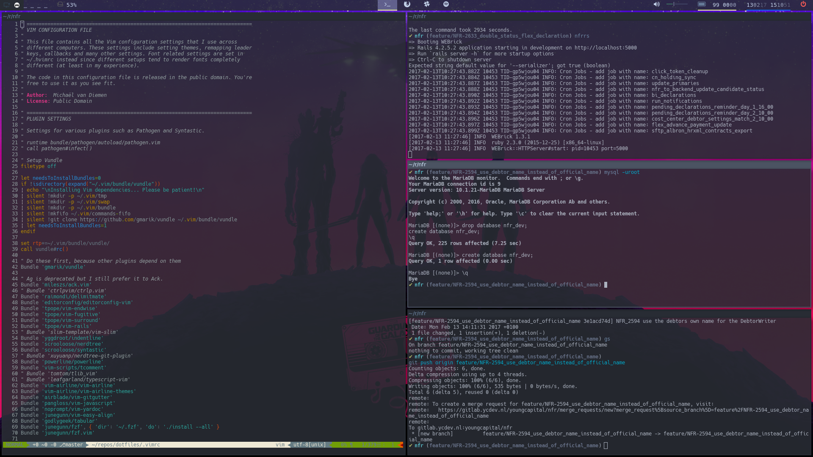

# Dotfiles

> ⚠️ **Deprecated** Please check [configuration](https://github.com/MvanDiemen/configuration)

## Setup
* There's a Makefile for setup **(not complete)**

### What do we use?
* I've chosen for [i3](https://i3wm.org) as my tiling window manager.
* [TWMN](https://github.com/sboli/twmn) for notifications.
* [Terminator](https://gnometerminator.blogspot.nl) as terminal because it has the capabilities of setting up multiple profiles.
* [Fish Shell](https://fishshell.com) instead of bash.

## i3
i3 is setup for both a single screen 1080p and a single screen 3840p (4K) screen.
With i3, there's a file that checks `xrandr` which screens are attached to correct the output for these screens.
There is also a script that sets up `terminator` with a readably font size depending on the resolution that you are running (1080p/3840p)

### 4K capabilities
As i3 can take care of the default setup, there are a few things left to get 4k running nicely.
I am using `nvim` for daily usage, but `gvim` is also setup for 4K with a 9/12/16 font size option (depending on screens).
Lastly, the rest of my default applications are: Chromium, Franz (or Slack) and Spotify, all of these have the option to use `--force-device-scale-factor=1.5` for a nice view in
4K.

## Screenshot
### 4K

### (outdated)

